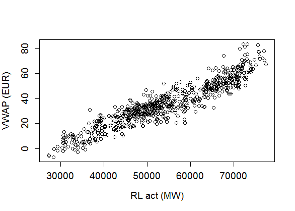

[](http://quantlet.de/)

## [](http://quantlet.de/) **VWAP_Descriptive** [](http://quantlet.de/)

```yaml

Name of QuantLet : VWAP_Descriptive

Published in : The behavior of electricity prices at the German intraday market

Description : Plot and tables to describe VWAP and exogenous variables

Keywords : 'plot, scatterplot, VWAP, residual load, renewable energy, correlation,
descriptive-statistics'

See also : 'VWAP_Forecast, VWAP_FPCA_Training, VWAP_FPCA_Forecast, VWAP_FASTEC_Training,
VWAP_FASTEC_Forecast, VWAP_Differenceplot, VWAP_Polygonplot, VWAP_PriceLoadSequence,
VWAP_Surfaceplot'

Author : Johannes Stoiber

Submitted : Sat, 22 April 2017 by Johannes Stoiber

Datafiles : VWAP.Rdata

```




### R Code:
```r
###############################################################################
##                                                                           ##
##          Descriptive Statistics                                           ##
##                                                                           ##
##          1. Table with summary statistics on variables                    ##
##          2. Scatterplot VWAP an RL                                        ##
##          3. Correaltion Table                                             ##
##                                                                           ##
###############################################################################

# load the R Environment with prepared data
load("VWAP.RData")

# load packages needed
libraries = c("stargazer", "e1071")
lapply(libraries, function(x)if(!(x %in% installed.packages())){install.packages(x)})
lapply(libraries, require, quietly = TRUE, character.only = TRUE)

# 1. Table with summary statistics on variables 
data.all = matrix(c(t(con_act)/1000,
                    t(spv_act)/1000,
                    t(wnd_act)/1000,
                    t(con_for)/1000,
                    t(spv_for)/1000,
                    t(wnd_for)/1000,
                    t(spot),
                    t(vwap)),
                  ncol=8)

summary           = t(apply(data.all, 2, FUN = function(X){c(mean(X), median(X), sd(X),  min(X), max(X), skewness(X))}))
rownames(summary) = c("CON act", "SPV act", "WND act", "CON MK", "SPV MK", "WND MK", "DA spot", "VWAP")
colnames(summary) = c("Mean", "Median", "SD", "Min", "Max", "Skewness")
stargazer(summary, digits = 2, type = "text")


# 2. Scatterplot VWAP and RL pdf 
plot(c(t(vwap)) ~ c(t(rel_act)),
     cex.lab = 1.2, cex.axis = 1.2, cex.main = 1.2,
     xlab    = "RL act (MW)",
     ylab    = "VWAP (EUR)")
dev.off()


# 3. Table with correlation
rel_for = con_for - spv_for - wnd_for
cor.tab = matrix(c("VWAP"    = c(t(vwap)),
                   "RL for"  = c(t(rel_for)),
                   "RL act"  = (t(rel_act)),
                   "RL diff" = c(t(rel_for - rel_act)),
                   "DA Spot" = c(t(spot))),
                 ncol = 5,
                 dimnames = list(c(),
                                 c("VWAP", "RL for", "RL act", "RL diff", "DA Spot")))

cor(cor.tab)

```
