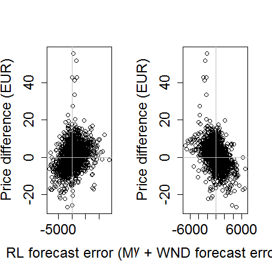

[](http://quantlet.de/)

## [](http://quantlet.de/) **VWAP_Differenceplot** [](http://quantlet.de/)

```yaml

Name of QuantLet : VWAP_Differenceplot

Published in : The behavior of electricity prices at the German intraday market

Description : 'Plot of difference between DA spot prices and VWAP of intraday trading vs forecast
error of residual load and renewable energy production'

Keywords : plot, scatterplot, VWAP, residual load, renewable energy

See also : 'VWAP_Forecast, VWAP_Differenceplot, VWAP_Polygonplot, VWAP_PriceLoadSequence,
VWAP_Descriptive, VWAP_FPCA_Training, VWAP_FPCA_Forecast, VWAP_FASTEC_Training,
VWAP_FASTEC_Forecast, VWAP_PriceLoadSequence, VWAP_Surfaceplot'

Author : Johannes Stoiber

Submitted : Sat, 22 April 2017 by Johannes Stoiber

Datafiles : VWAP.Rdata

```




### R Code:
```r
###############################################################################
##                                                                           ##
##          Scatterplot: Price difference vs. Forecast error                 ##
##                                                                           ##
##          1. Scatterplot Price difference vs Forecast error                ##
##                                                                           ##
###############################################################################

# load the R Environment with prepared data
load("VWAP.RData")

# Compute differences
p.diff    = spot - vwap
rl.diff   = con_for - wnd_for -spv_for - rel_act
ren.diff  = spv_for + wnd_for - spv_act - wnd_act


par(mfrow = c(1, 2), cex.lab = 1.5, cex.axis = 1.5, cex.main = 1.5)
plot(c(t(p.diff)) ~ c(t(rl.diff)),
     xlab = "RL forecast error (MW)",
     ylab = "Price difference (EUR)")
abline(h = 0, v = 0, col = "grey")

plot(c(t(p.diff)) ~ c(t(ren.diff)),
     xlab = "SPV + WND forecast error (MW)",
     ylab = "Price difference (EUR)")
abline(h = 0, v = 0, col = "grey")
dev.off()

```
