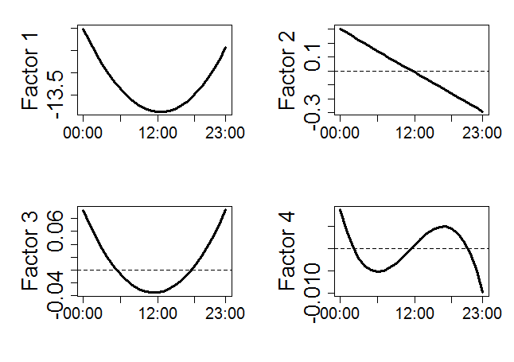
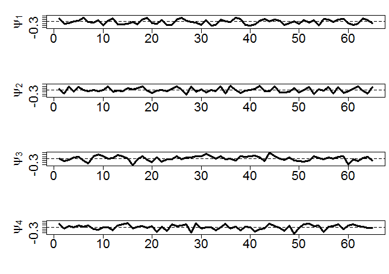
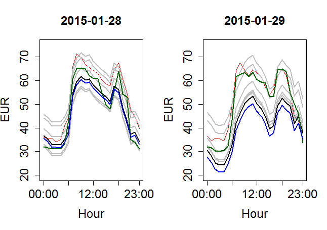
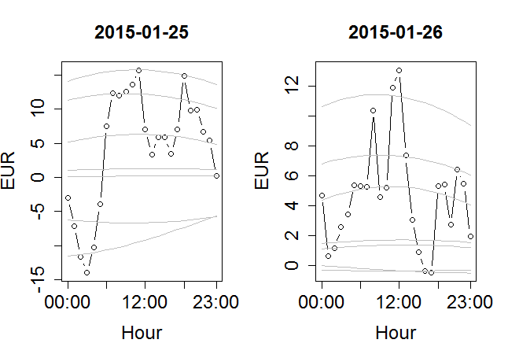

[](http://quantlet.de/)

## [](http://quantlet.de/) **VWAP_FASTEC_Training** [](http://quantlet.de/)

```yaml

Name of QuantLet : VWAP_FASTEC_Training

Published in : The behavior of electricity prices at the German intraday market

Description : 'Application of FASTEC on the training data. Fit VAR model on factor laodings.
Generate plots of daily curves and tables with error measures.'

Keywords : 'quantile regression, FASTEC, Short-term energy price forecasting, VWAP,
High-dimensional data analysis, Functional time series, VAR, factor loadings, pca'

See also : 'FASTECChinaTemper2008, FPCA_Electricity_Application, electricitypriceforecasting,
LQRCheck, VWAP_Forecast, VWAP_FPCA_Training, VWAP_FPCA_Forecast, VWAP_FASTEC_Forecast,
FPCA_Electricity_Simulation, FPCA_Electricity_Application, VWAP_Surfaceplot'

Author : Johannes Stoiber

Submitted : Sat, 22 April 2017 by Johannes Stoiber

Datafiles : VWAP.Rdata

```










### R Code:
```r
###############################################################################
##                                                                           ##
##       VWAP FASTEC Training. R-Script to apply FASTEC to desaisonalized    ##
##       the vwap weries, and fit a VAR model on the factor loadings         ##
##       Evaluation and plots after estimation procedure                     ##
##                                                                           ##
###############################################################################

# load the R Environment with prepared data and packages
load("VWAP.RData")
libraries = c("stargazer", "plyr","moments","zoo","forecast","urca","expectreg","fda.usc", "vars","lattice","tseries", "abind","sm","quantreg","matrixStats", "svdvis")
lapply(libraries,function(x)if(!(x %in% installed.packages())){install.packages(x)})
lapply(libraries,require,quietly=TRUE,character.only=TRUE)


###############################################################################
# set some prarameter
n             = 65                            # for first two years | Train Data length
hour          = 24                            # number of avialable daily observations
TAU           = c(0.01, 0.05, 0.25, 0.5, 0.75, 0.95, 0.99)  # quantiles of interest
model         = "fourier"                     # estimation of seasonal component
                                              # "fourier" includes also dummies for weekday and holidays
                                              # "no" only includes weekday and holidays
                                              # "smooth.spline", "sm.regression", "loess" do not include holiday and weekday effects
trsh          = .95                           # threshold how mouch should be explained by exogenous variables; apply PCA
lag.l         = 3                             # (lag.l-1) determines allowed maximum lag length for VAR models.chose fiteen to allow for past two weeks as impact  
p             = 1                             # parameter demanded by for seasonality forecast
k             = 0                             # k is used to set increasing steps, only needed to vary in testperiod
lt            = length(TAU)                   # number of expectils
holiday_dummy = holiday_dummy                 # dummy variable indicating public holidays
window        = 65                            # shorter window possible
window        = ifelse(exists("window"), 
                       window, n)
crit          = c("SC", "AIC")                # information criteria to select lag order
pf            = ceiling(hour^0.4)             # number of factors to choose
qt.5          = which(TAU %in% 0.5)            # index of 0.5 expectile
qt.l          = which(TAU %in% min(TAU))       # postion of lowest quantile in TAU vector
qt.u          = which(TAU %in% max(TAU))       # postion of highest (upper) quantile in TAU vector
###############################################################################

# Used Data
# input endogen
Input_list     = c(t(vwap[(1:n), ]))

# input exogen
Input_list_ex1 = c(t(spot[(1:n), ]))
Input_list_ex2 = c(t(con_act[(1:n), ]))
Input_list_ex3 = c(t(spv_act[(1:n), ]))
Input_list_ex4 = c(t(wnd_act[(1:n), ]))
Input_list_ex5 = c(t(con_for[(1:n), ]))
Input_list_ex6 = c(t(spv_for[(1:n), ]))
Input_list_ex7 = c(t(wnd_for[(1:n), ]))

# DSC: construct dummies for deseasonalization. wd and ph are only zeros
# because sun and wind do not care for weekend or public holidays
holiday_dummy = as.matrix(holiday_dummy, ncol = 1)
tempseq = as.numeric(rep(rep(c(1:7), each = 1), length.out = n + k + 2))
WD      = sapply(1:6, FUN = function(num){as.numeric(tempseq == num)})
wd      = matrix(rep(0, prod(dim(WD))), ncol = dim(WD)[2])
ph      = holiday_dummy; ph [,]= 0


# the seasonal component 
DSC_Fit         = matrix(dsc(Input_list, WD = WD, PH = holiday_dummy, n = n, k = k, hours = hour, p = p, model = model)[[2]], nrow = hour)

# compute desaisonalized series of vwap
resid_data_yearly = matrix(dsc(Input_list, WD = WD, PH = holiday_dummy, n = n, k = k, hours = hour, p = p, model = model)[[1]], nrow = hour)

# actual residual load components
DSC_Input_ex2   = dsc(Input_list_ex2, WD = WD, PH = holiday_dummy, n = n, k = k, hours = hour, p = p, model = model)[[1]]
DSC_Input_ex3   = dsc(Input_list_ex3, WD = wd, PH = ph, n = n, k = k, hours = hour, p = p, model = model)[[1]]
DSC_Input_ex4   = dsc(Input_list_ex4, WD = wd, PH = ph, n = n, k = k, hours = hour, p = p, model = model)[[1]]
DSC_Input_ex5   = dsc(Input_list_ex5, WD = WD, PH = holiday_dummy, n = n, k = k, hours = hour, p = p, model = model)[[1]]
DSC_Input_ex6   = dsc(Input_list_ex6, WD = wd, PH = ph, n = n, k = k, hours = hour, p = p, model = model)[[1]]
DSC_Input_ex7   = dsc(Input_list_ex7, WD = wd, PH = ph, n = n, k = k, hours = hour, p = p, model = model)[[1]]

# exogen as matrix
ex1_data_yearly   = matrix(dsc(Input_list_ex1, WD = WD, PH = holiday_dummy, n = n, k = k, hours = hour, p = p, model = model)[[1]], nrow = hour)
ex2_data_yearly = matrix(DSC_Input_ex2 - DSC_Input_ex3 - DSC_Input_ex4, nrow = hour)
ex3_data_yearly = matrix(DSC_Input_ex5 - DSC_Input_ex6 - DSC_Input_ex7, nrow = hour)
ex4_data_yearly = ex2_data_yearly - ex3_data_yearly

# compute Principal Components of the explanatory variables, select as much pc to explaine threshold
PCA_ex  = list( pca.man(t(ex1_data_yearly), tau = trsh),
                pca.man(t(ex2_data_yearly), tau = trsh),
                pca.man(t(ex3_data_yearly), tau = trsh),
                pca.man(t(ex4_data_yearly), tau = trsh))

# get the scores
scores.ex = lapply(PCA_ex, "[[", "scores" )

# For the MQR
xx          = seq(1/hour, 1, length = hour)
X.fac       = bs(xx, df = pf, intercept = TRUE)
X.val       = X.fac[,]
lamb        = lapply(X = c(1:lt), FUN = function(X){simtune(m = n, tau = TAU[X], XX = X.val, alpha = 0.1, B = 1000, const = 2)$lambda})
names(lamb) = paste(TAU)
itt         = 2000
epsilon     = 1e-06
kappa       = 1e-04

# default: loop runs only once.
for (i in 1:(n-window + 1)){
  
  # set parameters to create window
  #i=1
  w.start = i
  w.end   = w.start - 1 + window
  wind    = c(w.start:w.end)
  #wind = c(1:2)
  # compute the series needed
  Y   = data.matrix(resid_data_yearly[, wind])
  fit.exogen = lapply(scores.ex, "[", wind, TRUE)
  DSC_wind = DSC_Fit[, wind]
  
  # MQR for endogen and exogen variables
  fit.vwap = lapply(X = c(1:lt), FUN = function(X){mqr(Y = Y, X = X.val, tau = TAU[X], kappa = kappa, epsilon = epsilon, lambda = lamb[[X]], itt =itt)})
    
  # Compute Economy SVD
  # get the econ SVD
  # for each quantile get a U%*%D%*%t(V)
  # U is (pfxpf), D is (pfxpf), here; V is (mxpf); X.val = (24 x 4)
  econU = lapply(fit.vwap, "[[", "U")
  econd = lapply(lapply(fit.vwap, "[[", "d"), diag)
  # eonomy SVD, and assign column names for factor loadings
  econV = lapply(lapply(fit.vwap, "[[", "V"), "[", TRUE, c(1:pf))
  econV = lapply(econV, "colnames<-", paste0("load", seq(1, pf)))
    
  # compute fit for FASTEC
  curve.FASTEC  = lapply(X = c(1:lt), FUN = function(X){curve.mqr(X = X.val, U = econU[[X]], D = econd[[X]], fitted.model = econV[[X]],
                                                                  season = DSC_wind, startid = lag.l)})
  # VAR for both IC
  for (IC in crit){
      
    # compute VAR(X)(p) model:
    # endogen part
    mod.VAR  = lapply(X = c(1:lt), function(X){VAR(y = econV[[X]], lag.max = (lag.l - 1), type = "const", ic = IC)})
    
    # take into account exogen variables
    mod.spot = lapply(X = c(1:lt), function(X){VAR(y = econV[[X]], lag.max = (lag.l - 1), type = "const", ic = IC, exogen = fit.exogen[[1]])})
    mod.RLac = lapply(X = c(1:lt), function(X){VAR(y = econV[[X]], lag.max = (lag.l - 1), type = "const", ic = IC, exogen = fit.exogen[[2]])})
    mod.RLmk = lapply(X = c(1:lt), function(X){VAR(y = econV[[X]], lag.max = (lag.l - 1), type = "const", ic = IC, exogen = fit.exogen[[3]])})
    mod.RLdf = lapply(X = c(1:lt), function(X){VAR(y = econV[[X]], lag.max = (lag.l - 1), type = "const", ic = IC, exogen = fit.exogen[[4]])})
    
    # compute model fit
    fit.VAR  = lapply(X = c(1:lt), function(X){fitted(mod.VAR[[X]])})
    fit.spot = lapply(X = c(1:lt), function(X){fitted(mod.spot[[X]])})
    fit.RLac = lapply(X = c(1:lt), function(X){fitted(mod.RLac[[X]])})
    fit.RLmk = lapply(X = c(1:lt), function(X){fitted(mod.RLmk[[X]])})
    fit.RLdf = lapply(X = c(1:lt), function(X){fitted(mod.RLdf[[X]])})
    
    # reconstruct the fitted curve for stochastic part and add the seasonal component
    curve.VAR  = lapply(X = c(1:lt), FUN = function(X){curve.mqr(X = X.val, U = econU[[X]], D = econd[[X]], fitted.model = fit.VAR[[X]],  season = DSC_wind, startid = lag.l)})
    curve.spot = lapply(X = c(1:lt), FUN = function(X){curve.mqr(X = X.val, U = econU[[X]], D = econd[[X]], fitted.model = fit.spot[[X]], season = DSC_wind, startid = lag.l)})
    curve.RLac = lapply(X = c(1:lt), FUN = function(X){curve.mqr(X = X.val, U = econU[[X]], D = econd[[X]], fitted.model = fit.RLac[[X]], season = DSC_wind, startid = lag.l)})
    curve.RLmk = lapply(X = c(1:lt), FUN = function(X){curve.mqr(X = X.val, U = econU[[X]], D = econd[[X]], fitted.model = fit.RLmk[[X]], season = DSC_wind, startid = lag.l)})
    curve.RLdf = lapply(X = c(1:lt), FUN = function(X){curve.mqr(X = X.val, U = econU[[X]], D = econd[[X]], fitted.model = fit.RLdf[[X]], season = DSC_wind, startid = lag.l)})
    
    
    
    
    
    
    # store estimated curves
    if (IC == "AIC"){
      if ( i == 1 ){
        # 3d-array to store results
        cont.VAR.AIC  = array(NA, dim = c(hour, (n - lag.l + 1), lt) )
        cont.spot.AIC = array(NA, dim = c(hour, (n - lag.l + 1), lt) )
        cont.RLac.AIC = array(NA, dim = c(hour, (n - lag.l + 1), lt) )
        cont.RLmk.AIC = array(NA, dim = c(hour, (n - lag.l + 1), lt) )
        cont.RLdf.AIC = array(NA, dim = c(hour, (n - lag.l + 1), lt) )
        # in first loop, store compouted curves
        cont.VAR.AIC[, c(1:(window - lag.l + 1)), ]  = abind(curve.VAR, along = 3)
        cont.spot.AIC[, c(1:(window - lag.l + 1)), ] = abind(curve.spot, along = 3)
        cont.RLac.AIC[, c(1:(window - lag.l + 1)), ] = abind(curve.RLac, along = 3)
        cont.RLmk.AIC[, c(1:(window - lag.l + 1)), ] = abind(curve.RLmk, along = 3)
        cont.RLdf.AIC[, c(1:(window - lag.l + 1)), ] = abind(curve.RLdf, along = 3)
      }else{
        cont.VAR.AIC[, ] = abind(lapply(curve.VAR,"[",TRUE,(window-lag.l+1)), along = 2)
        cont.spot.AIC[, (w.end - lag.l + 1), ] = abind(lapply(curve.spot, "[", TRUE, (window - lag.l + 1)), along = 2)
        cont.RLac.AIC[, (w.end - lag.l + 1), ] = abind(lapply(curve.RLac, "[", TRUE, (window - lag.l + 1)), along = 2)
        cont.RLmk.AIC[, (w.end - lag.l + 1), ] = abind(lapply(curve.RLmk, "[", TRUE, (window - lag.l + 1)), along = 2)
        cont.RLdf.AIC[, (w.end - lag.l + 1), ] = abind(lapply(curve.RLdf, "[", TRUE, (window - lag.l + 1)), along = 2)
      } 
    }
    if (IC == "SC"){
      if ( i == 1 ){
        # 3d-array to store results
        cont.VAR.SC  = array(NA, dim = c(hour, (n - lag.l + 1), lt) )
        cont.spot.SC = array(NA, dim = c(hour, (n - lag.l + 1), lt) )
        cont.RLac.SC = array(NA, dim = c(hour, (n - lag.l + 1), lt) )
        cont.RLmk.SC = array(NA, dim = c(hour, (n - lag.l + 1), lt) )
        cont.RLdf.SC = array(NA, dim = c(hour, (n - lag.l + 1), lt) )
        # in first loop, store compouted curves
        cont.VAR.SC[, c(1:(window - lag.l + 1)), ]  = abind(curve.VAR, along = 3)
        cont.spot.SC[, c(1:(window - lag.l + 1)), ] = abind(curve.spot, along = 3)
        cont.RLac.SC[, c(1:(window - lag.l + 1)), ] = abind(curve.RLac, along = 3)
        cont.RLmk.SC[, c(1:(window - lag.l + 1)), ] = abind(curve.RLmk, along = 3)
        cont.RLdf.SC[, c(1:(window - lag.l + 1)), ] = abind(curve.RLdf, along = 3)
      }else{
        cont.VAR.SC[, (w.end - lag.l + 1), ]  = abind(lapply(curve.VAR, "[", TRUE, (window - lag.l + 1)), along = 2)
        cont.spot.SC[, (w.end - lag.l + 1), ] = abind(lapply(curve.spot, "[", TRUE, (window - lag.l + 1)), along = 2)
        cont.RLac.SC[, (w.end - lag.l + 1), ] = abind(lapply(curve.RLac, "[", TRUE, (window - lag.l + 1)), along = 2)
        cont.RLmk.SC[, (w.end - lag.l + 1), ] = abind(lapply(curve.RLmk, "[", TRUE, (window - lag.l + 1)), along = 2)
        cont.RLdf.SC[, (w.end - lag.l + 1), ] = abind(lapply(curve.RLdf, "[", TRUE, (window - lag.l + 1)), along = 2)
      } 
    } 
  }
}

###############################################################################
##                        Plot and Evaluation                                ##
##                                                                           ##
##       Table1: Model performance due to RMSE                               ##
##       Plot1:  Daily Curves with fitted values                             ##
##       Plot1:  Daily curves of stochastic part                             ##
##       Plot3:  Factor Scores                                               ##
##       Table2: Stationarity of loadings                                    ##
##       Table3: Percentage explained                                        ##
##                                                                           ##  
##                                                                           ##
###############################################################################

# Table1:
# Model performance due to RMSE
origin = t(vwap[c(lag.l:n), ])
qt.eval = qt.5
# compute errors at median
median.Fit     = list("DA spot AIC"    = cont.spot.AIC[, , qt.eval],
                      "RL actuals AIC" = cont.RLac.AIC[, , qt.eval],
                      "RL MK AIC"      = cont.RLmk.AIC[, , qt.eval],
                      "RL diff AIC"    = cont.RLdf.AIC[, , qt.eval],
                      "VAR AIC"        = cont.VAR.AIC[, , qt.eval], 
                      "DA spot SC"     = cont.spot.SC[, , qt.eval],
                      "RL actuals SC"  = cont.RLac.SC[, , qt.eval],
                      "RL MK SC"       = cont.RLmk.SC[, , qt.eval], 
                      "RL diff SC"     = cont.RLdf.SC[, , qt.eval],
                      "VAR SC"         = cont.VAR.SC[, , qt.eval],
                      "FASTEC Fit"     = curve.FASTEC[[qt.eval]],
                      "DA spot"        = t(spot[c(lag.l:n), ]), 
                      "Trend"          = DSC_Fit[, c(lag.l:n)]
                       )

# compute erroro measures
error.insample = t(sapply(X=c(1:length(median.Fit)), fit.eval, origin = origin, model = median.Fit))

bind.models = list(cont.spot.AIC,
                   cont.RLac.AIC,
                   cont.RLmk.AIC,
                   cont.RLdf.AIC,
                   cont.VAR.AIC, 
                   cont.spot.SC, 
                   cont.RLac.SC, 
                   cont.RLmk.SC, 
                   cont.RLdf.SC, 
                   cont.VAR.SC,
                   abind(curve.FASTEC, along = 3)
                   )

# add information how often VWAP is within predicted tau range 
error.insample = cbind(error.insample, 
                       "within_tau.01" = c(sapply(X = c(1:length(bind.models)), FUN = function(X){(hit.range(bind.models[[X]], origin, qt.l, qt.u))}), 
                                           rep(NA, 2)),
                       "within_tau.05" = c(sapply(X = c(1:length(bind.models)), FUN = function(X){(hit.range(bind.models[[X]], origin, 2, 6))}), 
                                           rep(NA, 2)),
                       "within_tau.25" = c(sapply(X = c(1:length(bind.models)), FUN = function(X){(hit.range(bind.models[[X]], origin, 3, 5))}), 
                                           rep(NA, 2)))


# add model information
error.insample = data.frame("TS model"  = c(rep("VAR", 10), "FASTEC Fit", "DA Spot", "Trend"),
                            "Selection" = c(rep("AIC",5), rep("BIC", 5),  rep(" - ", 3)),
                            "Exogenous Variable" = c(rep(c("DA Spot", "RL actual", "RL forecast", "RL difference", " - "), 2), rep(" - ", 3)),
                            error.insample)
# table the results
error.order    = error.insample[order(unlist(error.insample[, 5]), -unlist(error.insample[, 6])), ]
# Table in TeX output, suppress by type = "text
stargazer(error.order, summary = FALSE, rownames = FALSE, type = "text")


# Plot 1:
# Plot of the fitted curves
par(mfrow = c(1,2),cex.lab = 1.5, cex.axis= 1.5, cex.main = 1.5 )
for( day in 23:24){
  plot(as.numeric(vwap[day, ]),
       type = "l", 
       ylim = c(20, 75),
       main = rownames(vwap)[day],
       col= "red",
       xaxt = "n",
       xlab = "Hour",
       ylab = "EUR")
  for( j in 1:lt){
    col.fast = ifelse(j == qt.5, "black", "grey")
    lines(cont.spot.AIC[, day - lag.l + 1 , j], col = col.fast, lwd = 2)
  }
  lines(as.numeric(spot[day, ]), col = "darkgreen", lwd = 2)
  lines(DSC_Fit[,day], col = "blue", lwd = 2)
  axis(1, c(1, 7, 13, 19, 24), c("00:00", "06:00", "12:00", "18:00", "23:00"), cex.axis = 1.5)
}
dev.off()


# Plot 2:
# Plot of the stochastic component
stoch = lapply(X = c(1:lt), FUN = function(X){X.val %*% econU[[X]] %*% econd[[X]] %*% t(econV[[X]])})
par(mfrow = c(1,2),cex.lab = 1.5, cex.axis= 1.5, cex.main = 1.5 )
for(day in 20:21){ 
  plot(Y[, day], 
       type = "b", col = "black",
       main = rownames(vwap)[day],
       ylab = "EUR",
       xaxt = "n",
       ylim = range(0,Y[, day]),
       xlab = "Hour")
  for(j in 1:lt){
    lines(stoch[[j]][, day], col = "grey")
  }
  axis(1, c(1, 7, 13, 19, 24), c("00:00","06:00","12:00","18:00","23:00"), cex.axis = 1.5)
}
dev.off()


# Plot 3: 
# plot of factor scores at median
pc.m           = X.val %*% econU[[qt.5]] %*% econd[[qt.5]]

# construct the plot for Factorcurves
par(mfrow = c(2, 2), mar=c(5.2, 6.1, 2, 2)) 
for ( i in 1:4){
  plot(pc.m[, i], type = "l", xlab = "", xaxt = "n", ylab = paste0("Factor ", i),
       cex.lab = 2, cex.axis = 2, lwd = 3)
  abline(h = 0, lty = 2)
  axis(1,c(1, 7, 13, 19, 24), c("00:00", "06:00", "12:00", "18:00", "23:00"), cex.axis = 1.5)
  
}
dev.off()


# Plot 4: 
# Factor loadings 
par(mfrow = c(4, 1), mar=c(5.2, 6.1, 2, 0.5)) 
for ( i in 1:4){
  plot(econV[[qt.5]][, i], type = "l", xlab = "", ylab = bquote(psi[.(i)]),
       ylim = c(range(econV[[qt.5]])),
       cex.lab = 2, cex.axis = 2, lwd = 3)
  abline(h = 0, lty = 2)

}
dev.off()


# Table 2:
# Scores stationarity ADF + KPSS
stat.test = lapply(econV, FUN = stationarity.test)
names(stat.test) = paste(as.character(TAU), "quantile") 
ADF = sapply(stat.test, "[", 1, TRUE)
KPSS = sapply(stat.test, "[", 2, TRUE)
stargazer(ADF, type = "text")
stargazer(KPSS, type = "text")
warnings() 


# Table 3: 
# Percentage explained
pve = sapply(X = c(1:lt), FUN = function(X){diag(econd[[X]])^2 / sum(diag(econd[[X]])^2)})
rownames(pve) = c("Factor 1", "Factor 2", "Factor 3", "Factor 4")
colnames(pve) = as.character(TAU)
stargazer(pve, type = "text")

```
