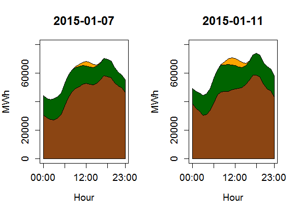

[](http://quantlet.de/)

## [](http://quantlet.de/) **VWAP_Polygonplot** [](http://quantlet.de/)

```yaml

Name of QuantLet : VWAP_Polygonplot

Published in : The behavior of electricity prices at the German intraday market

Description : Polygonplot that marks enrgy porduction sources for a winter and summer day.

Keywords : renewable energy, residual load, VWAP, Functional time series, polygon

See also : 'VWAP_Forecast, VWAP_FPCA_Training, VWAP_FPCA_Forecast, VWAP_FASTEC_Training,
VWAP_FASTEC_Forecast, VWAP_Differenceplot, VWAP_PriceLoadSequence, VWAP_Descriptive,
FPCA_Electricity_Simulation, FPCA_Electricity_Application, VWAP_Surfaceplot'

Author : Johannes Stoiber

Submitted : Sat, 22 April 2017 by Johannes Stoiber

Datafiles : VWAP.Rdata

```




### R Code:
```r
###############################################################################
##                                                                           ##
##               Polygonplot: Energy production by source                    ##
##                                                                           ##
###############################################################################

# load the R Environment with prepared data
load("VWAP.RData")

par(mfrow = c(1, 2))
for (day in c(2, 6)){
  plot(as.numeric(con_act[day, ]),
       main = list(as.character(df.data[day, 1]), cex = 1.5),
       ylim = c(0, 80000),
       type = "l",
       xlab = "Hour",
       ylab = "MWh",
       xaxt = "n",
       cex.axis = 1.2,
       cex.lab = 1.2)

  x  = c(1:24)
  y0 = c(rep(0, 24))
  y1 = as.numeric(rel_act[day, ])
  y2 = as.numeric(wnd_act[day, ]) + y1
  y3 = as.numeric(spv_act[day, ]) + y2
  
  polygon(c(x, rev(x)), c(y1, rev(y0)), col= "saddlebrown")
  polygon(c(x, rev(x)), c(y2, rev(y1)), col= "darkgreen")
  polygon(c(x, rev(x)), c(y3, rev(y2)), col= "orange")
  axis(1, c(1, 7, 13, 19, 24), c("00:00", "06:00", "12:00", "18:00", "23:00"), cex.axis = 1.2)
}


```
