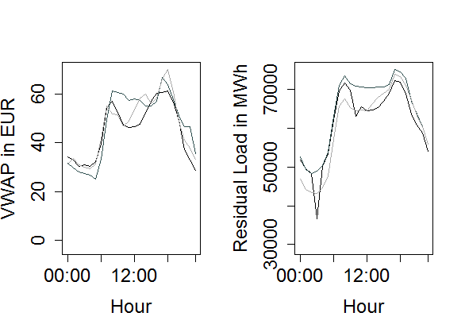

[](http://quantlet.de/)

## [](http://quantlet.de/) **VWAP_PriceLoadSequence** [](http://quantlet.de/)

```yaml

Name of QuantLet : VWAP_PriceLoadSequence

Published in : The behavior of electricity prices at the German intraday market

Description : Sequence of plots that show daily price and residual load movements.

Keywords : plot, sequence, VWAP, residual load, renewable energy

See also : 'VWAP_Forecast, VWAP_FPCA_Training, VWAP_FPCA_Forecast, VWAP_FASTEC_Training,
VWAP_FASTEC_Forecast, VWAP_Differenceplot, VWAP_Polygonplot, VWAP_Descriptive,
FPCA_Electricity_Simulation, FPCA_Electricity_Application, VWAP_Surfaceplot'

Author : Johannes Stoiber

Submitted : Sat, 22 April 2017 by Johannes Stoiber

Datafiles : VWAP.Rdata

```




### R Code:
```r
###############################################################################
##                                                                           ##
##               Sequenceplot: VWAP and Residual load                        ##
##                                                                           ##
###############################################################################

# load the R Environment with prepared data
load("VWAP.RData")

# moving picture:
# define a seuence of days. chosen arbitrary
dateseq = seq.Date(from = as.Date("2015-01-09"), to = as.Date("2015-01-20"), by ="day")
vw = as.matrix(vwap[ which(as.Date(rownames(vwap)) %in%  dateseq),]) 
rl = as.matrix(rel_act[ which(as.Date(rownames(rel_act)) %in%  dateseq),]) 

# loop with plots:
# pic 1: day 1 as black line
# pci 2: day 1 as grey line + day 2 as black line
# pic 3: day 1 as light grey + day 2 as grey + day 3 as as black line
# pic 3 + i: day (1 +i) as light grey + day (2+i) as grey + day (3+i) as as black line


for ( i in 1:dim(vw)[1]){
  par(mfrow=c(1,2))
  
  # pic 1
  if ( i == 1){
    plot(vw[i, ], type = "l", col = "black", ylim = range(vw), ylab = "VWAP in EUR", xlab = "Hour",
         xaxt = "n", cex.axis = 1.5, cex.lab = 1.5)
    axis(1, c(1, 7, 13, 19, 24), c("00:00", "06:00", "12:00", "18:00", "23:00"), cex.axis = 1.5)
    
    plot(rl[i, ], type = "l", col = "black", ylim = range(rl), ylab = "Residual Load in MWh", xlab = "Hour",
         xaxt = "n", cex.axis = 1.5, cex.lab = 1.5)
    axis(1, c(1, 7, 13, 19, 24), c("00:00", "06:00", "12:00", "18:00", "23:00"), cex.axis = 1.5)
    
  }
  # pic 2
  if (i == 2){
    plot(vw[i,], type = "l", col = "black", ylim = range(vw), ylab = "VWAP in EUR", xlab = "Hour",
         xaxt = "n", cex.axis = 1.5, cex.lab = 1.5)
    lines(vw[i-1, ], col = colors()[113])
    axis(1, c(1, 7, 13, 19, 24), c("00:00", "06:00", "12:00", "18:00", "23:00"), cex.axis = 1.5)
    
    plot(rl[i, ], type = "l", col = "black", ylim = range(rl), ylab = "Residual Load in MWh", xlab = "Hour",
         xaxt = "n", cex.axis = 1.5, cex.lab = 1.5)
    lines(rl[i-1, ], col = colors()[113])
    axis(1, c(1, 7, 13, 19, 24), c("00:00", "06:00", "12:00", "18:00", "23:00"), cex.axis = 1.5)
    
  }
  # pic 3
  if ( i > 2){
    plot(vw[i, ], type = "l", col = "black", ylim = range(vw), ylab = "VWAP in EUR", xlab = "Hour",
         xaxt = "n", cex.axis = 1.5, cex.lab = 1.5)
    lines(vw[i-1, ], col = colors()[113])
    lines(vw[i-2, ], col = colors()[82])
    axis(1, c(1, 7, 13, 19, 24), c("00:00", "06:00", "12:00", "18:00", "23:00"), cex.axis = 1.5)
    
    plot(rl[i, ], type = "l", col = "black", ylim = range(rl), ylab = "Residual Load in MWh", xlab = "Hour",
         xaxt = "n", cex.axis = 1.5, cex.lab = 1.5)
    lines(rl[i-1, ], col= colors()[113])
    lines(rl[i-2, ], col=colors()[82])
    axis(1, c(1, 7, 13, 19, 24), c("00:00", "06:00", "12:00", "18:00", "23:00"), cex.axis = 1.5)
    
  }
}

```
