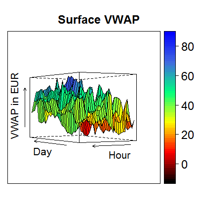

[](http://quantlet.de/)

## [](http://quantlet.de/) **VWAP_Surfaceplot** [](http://quantlet.de/)

```yaml

Name of QuantLet : VWAP_Surfaceplot

Published in : The behavior of electricity prices at the German intraday market

Description : Plot intradaily curves of VWAP and residual laod as surface plot.

Keywords : 'surface, functional data, electricity, residual load, VWAP, time-series, Functional
time series'

See also : 'VWAP_Forecast, VWAP_FPCA_Training, VWAP_FPCA_Forecast, VWAP_FASTEC_Training,
VWAP_FASTEC_Forecast, VWAP_Differenceplot, VWAP_Polygonplot, VWAP_PriceLoadSequence,
VWAP_Descriptive, FPCA_Electricity_Simulation, FPCA_Electricity_Application'

Author : Johannes Stoiber

Submitted : Sat, 22 April 2017 by Johannes Stoiber

Datafiles : VWAP.Rdata

```





### R Code:
```r
###############################################################################
##                                                                           ##
##                Surfaceplot: VWAP and Residual load                        ##
##                                                                           ##
###############################################################################

load("VWAP.RData")
libraries = c("lattice")
lapply(libraries, function(x)if(!(x %in% installed.packages())){install.packages(x)})
lapply(libraries, require, quietly = TRUE, character.only = TRUE)

# VWAP png
wireframe(as.matrix(vwap), 
          xlab = list("Day", rot = 0, cex = 1.3),
          ylab = list("Hour", rot = 0, cex = 1.3), 
          zlab = list(" VWAP in EUR", rot= 90, cex = 1.3),
          aspect = c(0.6, 0.6),
          main = list("Surface VWAP", cex = 1.5),
          drape = TRUE,
          colorkey = TRUE,
          col.regions = colorRampPalette(c("black", "red", "yellow", "springgreen", "royalblue", "blue"))(100),
          screen=list(x = -90, y = 120, z = 0),
          trellis.par.set(list(axis.text = list(cex = 1.5))))


# residual load
wireframe(as.matrix(rel_act), 
          xlab = list("Day", rot = 0, cex = 1.3),
          ylab = list("Hour", rot = 0, cex = 1.3), 
          zlab = list(" Residual Load in EUR", rot= 90, cex = 1.3),
          aspect = c(0.6, 0.6),
          main = list("Surface Residual Load", cex = 1.5),
          drape = TRUE,
          colorkey = TRUE,
          col.regions = colorRampPalette(c("black", "red", "yellow", "springgreen", "royalblue", "blue"))(100),
          screen = list(x = -90, y = 130, z = 0),
          trellis.par.set(list(axis.text = list(cex = 1.5))))

```
